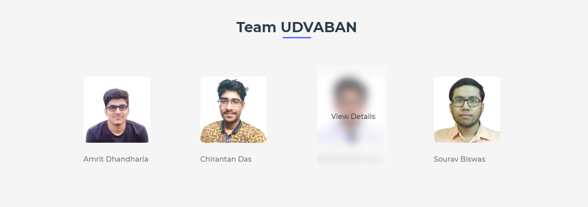

   

# 🩺 Project [SUSHRUTA](https://github.com/Team-Udvaban/Project-SUSHRUTA)

### 💻 _By: [Team Udvaban](https://github.com/Team-Udvaban)_   

An all in one portal to set up your appointments with specialised field physicians, get treatment recommendations, check your symptoms, get info about top doctors and a lot more.

 

---

## 🎯 _Table Of Contents:_

 

📌 [Overview](https://github.com/Team-Udvaban/Project-SUSHRUTA#-overview)

📌 [Features](https://github.com/Team-Udvaban/Project-SUSHRUTA#-features)

📌 [Browser Support](https://github.com/Team-Udvaban/Project-SUSHRUTA#-browser-support)

📌 [Operating System Support](https://github.com/Team-Udvaban/Project-SUSHRUTA#-operating-system-support)

📌 [Get Started](https://github.com/Team-Udvaban/Project-SUSHRUTA#-get-started)

📌 [Deploy Project](https://github.com/Team-Udvaban/Project-SUSHRUTA#-deploy-project)

📌 [Description Video](https://github.com/Team-Udvaban/Project-SUSHRUTA#-description-video)

📌 [Tools & Tech stacks](https://github.com/Team-Udvaban/Project-SUSHRUTA#-tools--tech-stacks-)

- Editors and IDE Used
- Languages Used
- Version Control
- Hosting Platform

📌 [Connect With Us](https://github.com/Team-Udvaban/Project-SUSHRUTA#-connect-with-us-)

📌 [References](https://github.com/Team-Udvaban/Project-SUSHRUTA#references)
 

---

### 📊 Overview

This is basically a website build on very low experiences only with HTML, CSS and JavaScript.

The doctor suggestion system and also the appointment system are based on Java.

And lastly there is a Python and MongoDB based DBMS running on a Flask API.

 

---

### ⚙ Features

 

1. A user friendly yet attractive interface for ease of access
    
2. A easy and secure login/registration system
    
3. A doctor reccomendation system based on the symptoms analysis
    
4. A greater reach to the Multi-speciality hospitals and high rated doctors
    
5. A Cross platform environment

 

---

### 🌐 Browser Support

    

 

### 💻 Operating System Support

  **Note**: Support for modern mobile browsers is experimental. The website is not responsive in mobile devices until now.

 

---

### 🚩 Get Started

 

#### 1. _Main Page :_

 

> 1.1 **Home**

  
On the homepage, you can see the nav bar on top where we have created various sections all of which we will discuss one by one.

 

> 1.2 **About**

  
In the 'About' section, the user can see a brief description about what our aim is with Sushruta and also can connect us via various social platforms.

 

> 1.3 **Doctors**

  
In the 'Doctors' section, the user can see basic details about the top doctors those have collaborated with our system and if required, user can directly book an appointment with any particular doctor.

 

> 1.4 **Our Team**

  
in the 'Team' section, we’ve also mentioned the entire team Udvaban and if you want further details of any individual you can just click on the image and visit their respective LinkedIn profiles.

 

> 1.5 **Contact Us**

  
We’ve also created a section where the user can contact us in case of any grievance/complaint/suggetions or feedback.

 

> 1.6 **Footer**

  
The footer section of the page has all the social links, explorer section and our team’s logo along with copyright statement.

 

#### 2. _Sign In / Sign Up Page :_

 

> **Login Button**

  
Now, clicking on the login button, the user is taken to another page where they can either Sign In or Sign Up as a new user.

 

> - ##### 2.1 Sign In (An user who have already registered) :-  

 

> 2.1.1 **Various ways of Signing In**

 
There are 3 ways to Login / Sign In, i.e. using username and password, using social media accounts or the Sawo labs API. 
  

Eg: How to Login using Sawo Labs API

 

> 2.1.2 **Doctors Details**

   
After logging in successfully, the user can now see the details of the doctors including their departments, degrees, chamber location and what they charge for an appointment.

 

> 2.1.3 **Want Suggestions ?**

   
Now if the user wants to get any recommendation from our side, then he/she can click on the ‘Want Suggestions?’ button situated on bottom of the doctors section which will open a text box form where they can write their symptoms.
according to these we and our doctors’ team will recommend possible tests, diagnosis and direct appointments if necessary.

 

> 2.1.4 **AI Based Doctor Prediction Java Application**

   
So, these are the AI Based Doctor Prediction Java Appication and Appointment Booking Java Application. The primary function of the AI Based Doctor Prediction Java Appication is to accept the various symptoms.

 

> 2.1.5 **Booking an Appointment Java Application**

   
With the application of AI, the best suited Doctor/Doctors who will be able to cure the disease will be appointed to the patient. After the appointment, the patient will proceed towards booking the appointment with the specified doctor as per the choice of patient and availability of slots.
Consequently, the patient will be able to book the slot and then checkout successfully.
  

> - ##### 2.2 Sign Up (An user who is going to register) :-

  

> 2.2.1 **Ways for Sign Up**

  
From the sign in/sign up page, the user can either sign up with their email or via social accounts.

 

> 2.2.2 **Registration Process**

   
After that, the user get redirected to a registration page where they have to fill in their basic details like name, gender and phone number and also then create a new username and password.
Next click on the 'Proceed' button.

 

> 2.2.3 **Redirect to main page**

   
After proceeding, they user is directed back to the main page where they now see the details of our doctors and remaining process is same as for the previously logged in users.

 

---

### 🎰 Deploy Project   

##### You can deploy SUSHRUTA... [Click Here.](https://team-udvaban.github.io/Project-SUSHRUTA)

 

---

### 🎬 Description Video

  

##### _Platform:_ 

To start the video [Click Here.]()
 

---

### 🛠 Tools & Tech stacks   

- #### 🔰 _Editors and IDE Used:_   

   

 

- #### 🔰 _Languages Used:_   

     

 

- #### 🔰 _Version Control:_   

 

 

- #### 🔰 _Hosting Platform:_   

 

---

## 📢 Connect with us:  

###### • _[Amrit Dhandharia](https://www.linkedin.com/in/amrit-dhandharia-0766791b6)_

###### • _[Chirantan Das](https://www.linkedin.com/in/chirantan-das-0a45ab20b)_

###### • _[Sanjib Kumar Das](https://www.linkedin.com/in/sanjib-kumar-das-2a742920b)_

###### • _[Sourav Biswas](https://www.linkedin.com/in/sourav-biswas-220207200)_

 

---

##### References:

[W3 Schools](https://www.w3schools.com/) | [Geeks for Geeks](https://www.geeksforgeeks.org/) | [Stack Overflow](https://stackoverflow.com/) | [Tutorial](https://www.youtube.com/watch?v=m9LKX9yE3r0) | [Github](https://github.com/JunaidShamnad/SignIn-SignUp-Form) | [SAWO Labs](https://sawolabs.com/resources) | [Udemy](https://www.udemy.com/course/build-responsive-website-using-html5-css3-js-and-bootstrap-p/learn/lecture/24007924?start=0#overview) | [Coursera](https://www.coursera.org/specializations/web-design) | [Great Learning](https://www.greatlearning.in/) | [Markdown](https://www.youtube.com/watch?v=HUBNt18RFbo)
